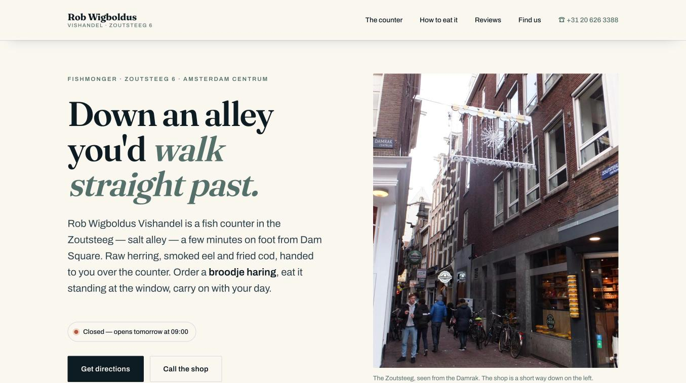

# Rob Wigboldus Vishandel — landing page



A single-page website for [Rob Wigboldus Vishandel](https://www.google.com/maps/search/?api=1&query=Rob+Wigboldus+Vishandel%2C+Zoutsteeg+6%2C+1012+LX+Amsterdam),
a fishmonger's counter at Zoutsteeg 6 in central Amsterdam.

The shop has no website. Its entire online presence is third-party review
listings and two dormant social accounts, so this page is built from what could
be independently verified about the business — and nothing else.

> **Unaffiliated.** This is an experiment in building a site from public
> research, not a commissioned project. It has no connection to the business,
> was not requested by it, and is not being sold to anyone. The name and details
> are used descriptively; the code is MIT licensed, but the photography is under
> the Creative Commons terms listed in
> [`assets/img/CREDITS.md`](assets/img/CREDITS.md).

## Running it

Open `index.html` in a browser. That is the whole procedure.

There is no build step, no package manager, no dev server and no dependencies.
The page runs correctly straight off the filesystem (`file://`), which is a
deliberate constraint: it means no ES modules, no `fetch()` of local data, no
map iframe, and every asset committed to the repo rather than hotlinked.

```
index.html          the page
styles/main.css     all styling
scripts/main.js     open/closed status, mobile nav, scroll reveal
assets/img/         photography, with CREDITS.md
claude-screenshots/ screenshot of the finished page
.github/notes/      research dossier and build roadmap
```

The only external request is the Google Fonts stylesheet. Every font has a real
fallback stack, so the page is correct offline — it just sets in Georgia and the
system sans instead.

## How it was built

- [`.github/notes/INFO.md`](.github/notes/INFO.md) — the research. Every fact is
  tagged High/Medium/Low confidence with a source, plus an explicit list of
  plausible-sounding claims that could **not** be verified and are therefore
  banned from the page.
- [`.github/notes/ROADMAP.md`](.github/notes/ROADMAP.md) — architecture
  decisions, design direction, build phases and the definition of done.

## Factual ground rules

These are enforced throughout and are the reason the page reads the way it does:

- **No prices.** Reported figures span several years and none came from the
  business. The page points at the board in the shop instead.
- **No founding year, no invented history**, no "family run for generations".
  Nothing verifiable was found, so nothing is claimed.
- **No fabricated testimonials.** Review quotes are verbatim from public
  reviews, marked as visitor reviews, and attributed to no individual.
- **No stock photo is framed as depicting this shop.** The one photograph that
  genuinely shows the location is the Zoutsteeg street sign on the Damrak
  corner. Everything else illustrates subject matter only. See
  [`assets/img/CREDITS.md`](assets/img/CREDITS.md).
- **Hours and payment are presented as "confirm by phone"**, because they are
  the least certain facts on the page and the ones most likely to waste
  somebody's walk across town.

## Known unknowns

Public sources only get you so far. Five things could not be settled without
asking the business directly, and they are listed at the end of `INFO.md`. The
two that actually matter:

- **Opening hours.** The shop's own Instagram bio says 09:00–18:00; the
  aggregators say 08:00–17:00. The page follows the first-party figure and tells
  visitors to call before a long detour.
- **Payment.** Multiple listings say cash only, a few say card is sometimes
  accepted. The page says cash is the safest bet, which is true either way.

Anything that could not be verified is absent rather than guessed — see §8 of
`INFO.md` for the full list of claims that were found and deliberately dropped.
